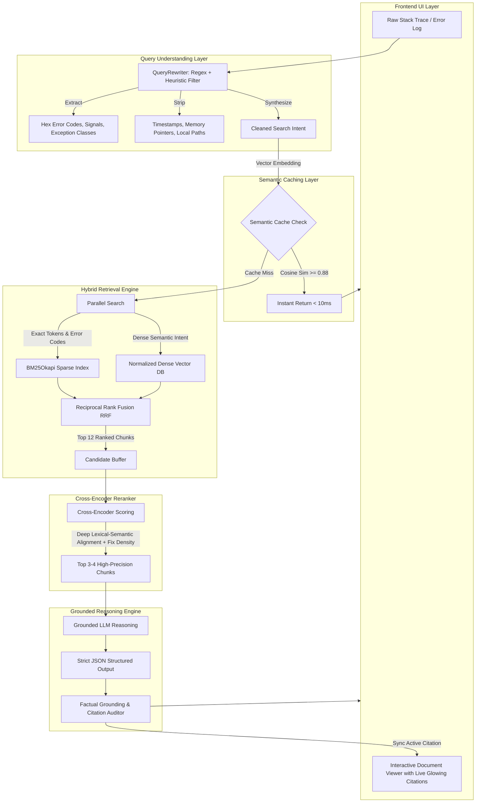

# TraceMind Architecture & Technical Deep-Dive

## 1. Problem Framing & Motivation
Standard Conversational RAG applications are designed for broad question-answering over articles or marketing copy. However, when applied to software and DevOps debugging:
- **Exact Token Failure**: Pure vector embeddings collapse distinct error codes (e.g. `0x80070005` vs `0x80070002` vs `0xC0000005`) into generic "permission or file error" clusters.
- **Noise Sensitivity**: Stack traces contain thousands of characters of memory pointers (`0x7ffeef`), timestamps, and machine paths (`C:\Users\...`) that dilute dense semantic embeddings.
- **Hallucinated Remediation**: LLMs invent plausible-sounding CLI flags (`--force-admin`) that don't exist in the actual software documentation.
- **Latency & Repeated Errors**: Production environments encounter identical or similar errors repeatedly, wasting API credits on redundant generation.

TraceMind is engineered specifically to eliminate these failure modes through an **Applied RAG** pipeline.

---

## 2. End-to-End Pipeline Architecture

---

## 3. Mathematical & Algorithmic Formulations

### 3.1 Reciprocal Rank Fusion (RRF)
Given a set of candidate document chunks $D$ and multiple rankers $M = \{BM25, Vector\}$, the RRF score is computed as:
$$RRF(d \in D) = \sum_{m \in M} \frac{1}{k + r_m(d)}$$
where:
- $k = 60$ (constant that dampens the impact of high-ranking outliers from any single ranker).
- $r_m(d)$ is the 1-based rank position of chunk $d$ in the output of model $m$.

### 3.2 Semantic Vector Similarity
Dense vectors $v_q, v_d \in \mathbb{R}^n$ are $L_2$-normalized during indexing:
$$\hat{v} = \frac{v}{\|v\|_2}$$
Cosine similarity simplifies to a fast inner dot product:
$$\text{Sim}(q, d) = \hat{v}_q \cdot \hat{v}_d$$

### 3.3 Semantic Cache Thresholding
Incoming search intent vectors $\hat{v}_q$ are checked against previously stored vectors $\{\hat{v}_i\}$ in the cache store:
$$\text{Hit Condition}: \max_{i} (\hat{v}_q \cdot \hat{v}_i) \ge \tau \quad (\tau = 0.88)$$
If met, execution bypasses vector retrieval, cross-encoding, and LLM calls, returning the verified grounded diagnosis in under 10 milliseconds.

---

## 4. Grounded Citation Verification & Zero-Hallucination Proof
Each citation generated by TraceMind includes:
1. `doc_id`: Unique identifier of the source runbook.
2. `page_or_section`: Section heading or page number.
3. `snippet`: Verbatim string segment extracted from the source chunk.
4. `relevance_explanation`: Rationale explaining why this documentation excerpt resolves the error.

In the frontend console:
- When a user clicks any citation card or chip, the **Source Knowledge Viewer** automatically selects the referenced runbook.
- The document content is inspected, and the exact citation snippet is wrapped in a `<mark class="grounded-highlight">` element with a glowing amber border and visual provenance badge.
- The document smoothly scrolls to center the highlighted text in the user's viewport.
This provides tangible proof to engineers and interviewers that the answer is not hallucinated.
